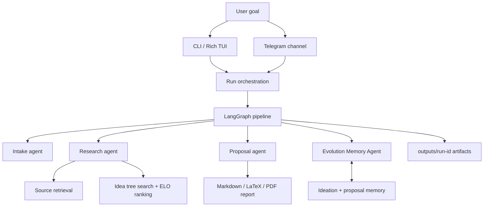
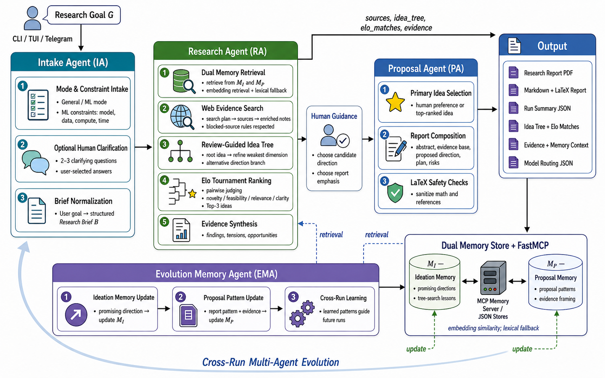

# EvoResearcher

EvoResearcher is an interactive deep-research proposal system. It uses LangGraph orchestration, DeepSeek models, dual JSON memory, tree-search ideation, and report generation to turn a research goal into ranked ideas and a concise PDF/Markdown report.

## System Structure





Key modules:

- `evoresearcher/main.py`: CLI entrypoint.
- `evoresearcher/runner.py`: reusable run orchestration.
- `evoresearcher/orchestration/graph.py`: LangGraph workflow.
- `evoresearcher/agents/`: intake, research, proposal, and memory agents.
- `evoresearcher/research/`: tree search and ELO tournament logic.
- `evoresearcher/report/`: report rendering.
- `evoresearcher/channels/telegram.py`: optional Telegram bot channel.

## Setup

Requires Python 3.11+.

```bash
python -m venv .venv
source .venv/bin/activate
pip install -e '.[dev]'
```

Create `.env`:

```bash
DEEPSEEK_API_KEY=...
DEEPSEEK_MODEL=deepseek-chat
DEEPSEEK_REASONING_MODEL=deepseek-v4-pro
DEEPSEEK_BASE_URL=https://api.deepseek.com/chat/completions
```

Optional Telegram support:

```bash
pip install -e '.[telegram]'
```

```bash
TELEGRAM_BOT_TOKEN=...
TELEGRAM_ALLOWED_USER_IDS=123456789
```

## How to Run

Run from the CLI:

```bash
evoresearcher --mode general --goal "Investigate why social protection programs in South Asia often fail the ultra-poor."
```

Equivalent module form:

```bash
python -m evoresearcher.main --mode ml --goal "Design a robust benchmark for long-context retrieval agents."
```

Start the Telegram bot:

```bash
evoresearcher-telegram
```

Outputs are written to `outputs/<run-id>/`, including `research_report.md`, `research_report.tex`, `research_report.pdf`, `top_ideas.json`, `idea_tree.json`, `sources.json`, and `run_summary.json`.

## Example Usage

General research:

```bash
evoresearcher --mode general --goal "Map the main causes of urban heat inequality and propose interventions."
```

ML research:

```bash
evoresearcher --mode ml --goal "Propose a method for evaluating hallucination in multimodal assistants."
```

Fast model override:

```bash
evoresearcher --mode general --global-model deepseek-v4-flash --goal "Draft a fast evidence scan on AI tutor effectiveness."
```

Disable web retrieval:

```bash
evoresearcher --mode general --no-search --goal "Generate research directions for memory-augmented agents."
```

Run tests:

```bash
pytest
```
